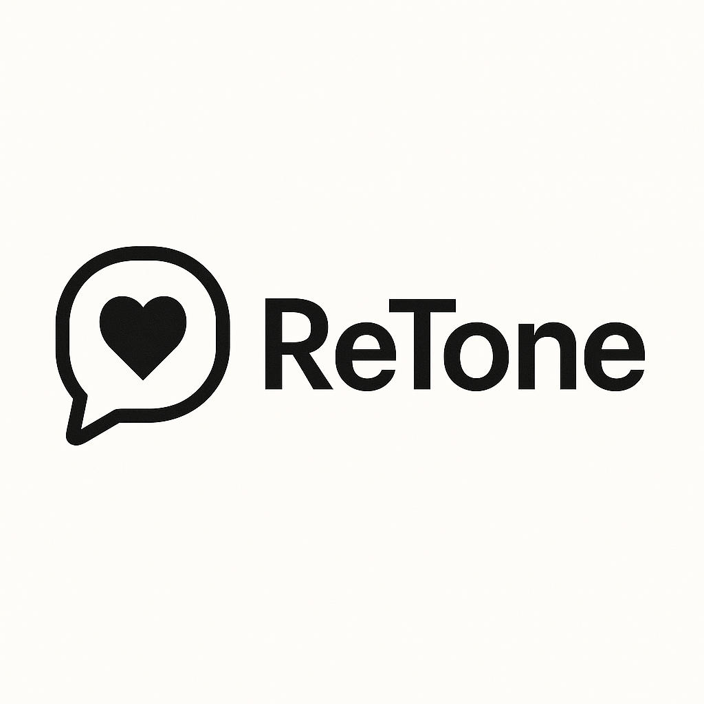

  

<em>Say it softly. Mean it clearly.</em>

---

**ReTone** is an AI-powered communication assistant that helps you rephrase your messages with the right tone.  
Simply type your raw sentence, choose the tone you want to convey — *Serious, Friendly, Humorous, and Loving* —  
and ReTone returns a well-balanced, context-aware version that says what you mean, the way you mean it ✨ 

❤️ Built with
Python · Flask · HTML/CSS
and a lot of empathy for real-world conversations 🤍

🛠 Roadmap
- [ ] Improved UI/UX design
- [ ] Automatic tone detection (input analysis)
- [ ] Add more tones (Apology, Empathic, Assertive)
- [ ] Telegram Bot integration
- [ ] Local history and ready-made templates

