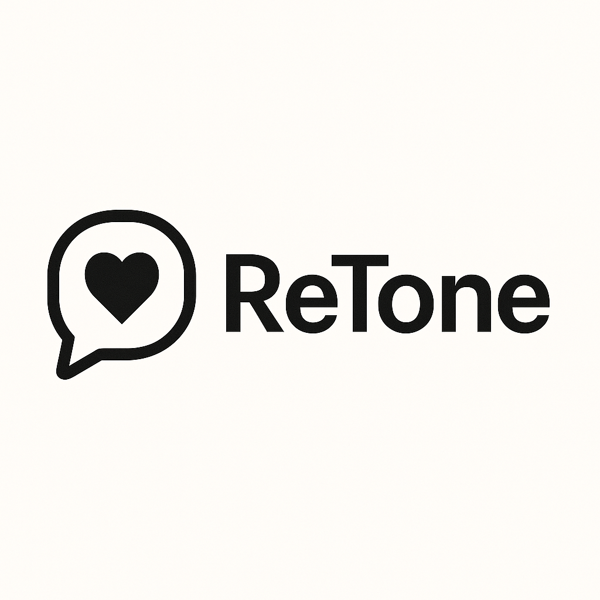

  

<em>Say it softly. Mean it clearly.</em>

---
Click here

**ReTone** is an AI-powered communication assistant that helps you rephrase your messages with the right tone.  
Simply type your raw sentence, choose the tone you want to convey — *Serious, Friendly, Humorous, and Loving* —  
and ReTone returns a well-balanced, context-aware version that says what you mean, the way you mean it ✨ 

**Built with**
Python · Flask · HTML/CSS
and a lot of empathy for real-world conversations ❤️

**What to monitor in ReTone:**

App (Flask)
- HTTP requests per second
- Error rate (4xx/5xx), esp. 429 from upstream
- Latency (p50/p90/p99)
- External calls: OpenRouter success/error/latency

Kubernetes/Container
- Pod restarts
- CPU / Memory (requests vs usage)
- Readiness/Liveness probe failures

Ingress (Traefik)
- Requests, errors, latency per route/host

Uptime
- Synthetic check (blackbox-exporter) to public URL

🛠 **Roadmap**
- [ ] Improved UI/UX design
- [ ] Automatic tone detection (input analysis)
- [ ] Add more tones (Apology, Empathic, Assertive)
- [ ] Telegram Bot integration
- [ ] Local history and ready-made templates

